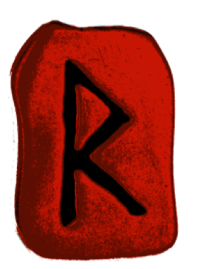
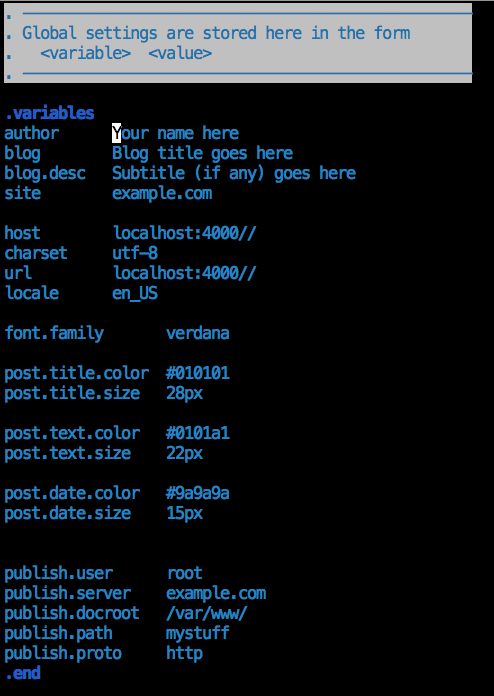
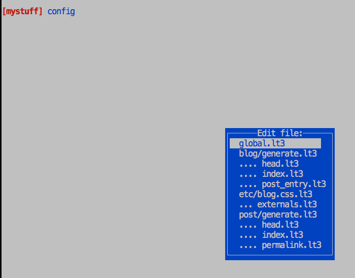

</img>

<h1>runeblog</h1><b>Runeblog</b> is a blogging tool written in Ruby. It has these basic characteristics:
<ul>
  <li>It is usable entirely in text mode from the terminal</li>
  <li>It publishes web pages as static HTML</li>
  <li>So far, yes, like Jekyll</li>
  <li>It's based on Livetext (highly extensible Ruby-based markup)</li>
  <li>It has the concept of multiple "views" for a blog</li>
  <li>The multiple views are in effect multiple blogs managed with the same backend.</li>
</ul>

## What is Livetext?
Livetext is a markup format that is a throwback to the old, old days of text 
formatters such as <tt>roff</tt> It's very flexible, and it is extensible <i>in Ruby</i>. 

It is far from mature or full-featured, but it is usable. Runeblog uses Livetext, 
along with some custom definitions, to try to ease the formatting of a blog entry.

## What are "views"?
Think of them as multiple separate blogs with the same backend. Why would you
want to do this? Maybe you wouldn't, but I do.

The purpose is to present different "faces" to different audiences. In my case,
my computing-related stuff would go into one view, and my hometown-related things
would go into another. There might be a view that only old friends or close friends
can see. There might be a view purely for reviews of music, books, and movies. 

But the important points are these:

 * <i>All</i> the views will be managed the same way in the same place, and they will all share common data.
 * Any post can easily be included in a single view, in more than one, or in all of them.
 * Each view can have its own look and feel, and it can be linked/published separately from the others.
 * Each view can be hosted in a different location and/or a different server and domain
 * Any post can be in more than one view

## The <tt>blog</tt> environment
There is a command-line tool called <tt>blog</tt>  which is a REPL (read-eval-print loop). 
Note that this tool is a curses-based environment (mainly so it can display menus
and such to the user).

The help message looks like this:

<pre>
  <b>Basics:</b>                                         <b>Views:</b>
  -------------------------------------------     -------------------------------------------
  <b>h, help</b>           This message                  <b>change view VIEW</b>  Change current view
  <b>q, quit</b>           Exit the program              <b>cv VIEW</b>           Change current view
  <b>v, version</b>        Print version information     <b>new view</b>          Create a new view
  <b>clear</b>             Clear screen                  <b>list views</b>        List all views available
                                                         <b>lsv</b>               Same as: list views
 
  <b>Posts:</b>                                          <b>Advanced:</b>
  -------------------------------------------     -------------------------------------------
  <b>p, post</b>           Create a new post             <b>config</b>            Edit various system files
  <b>new post</b>          Same as p, post               <b>customize</b>         (BUGGY) Change set of tags, extra views
  <b>lsp, list posts</b>   List posts in current view    <b>preview</b>           Look at current (local) view in browser
  <b>lsd, list drafts</b>  List all drafts (all views)   <b>browse</b>            Look at current (published) view in browser
  <b>delete ID [ID...]</b> Remove multiple posts         <b>rebuild</b>           Regenerate all posts and relink
  <b>undelete ID</b>       Undelete a post               <b>publish</b>           Publish (current view)
  <b>edit ID</b>           Edit a post                   <b>ssh</b>               Login to remote server
  <b>import ASSETS</b>     Import assets (images, etc.)  <b>manage WIDGET</b>     Manage content/layout of a widget
</pre>

## Getting started
But when you first run the REPL, it checks for an existing blog repository under 
the <tt>.blogs</tt> directory. If it doesn't find one, it asks whether you want to create 
a new blog repo. Enter <tt>y</tt>  for yes.

You'll then enter the editor (vim for now) to add configuration info to the <tt>global.lt3</tt>  file.

<!-- <pre><b>FIXME add menu screenshot here</b></pre> -->
<!-- <pre><b>FIXME add vim screenshot here</b></pre> -->
</img>

The next thing you should do is to create at least one view of your own. Use the <tt>new view</tt> 
command for this. Note that the current view is displayed as part of the prompt.

<pre>
<b>[no view]</b> new view mystuff 
<b>[mystuff]</b>
</pre>

To create a new post, use the <tt>new post</tt> command (also abbreviated <tt>post</tt>  or simply <tt>p</tt>). You will be
prompted for a title:

<pre>
<b>[mystuff]</b> new post 
<b>Title:</b> This is my first post
</pre>

Then you'll be sent into the editor (currently vim but can be others):

</img>

<pre>
<b>FIXME wizard?</b>
(publishing one-time setup - server, ssh keys, etc.)
preview...
publish...
browse...
(and so on)
</pre>

<b>To be continued</b>

## Customizing the default templates and configuration
You can use the <tt>config</tt>  command to choose a file to edit.

</img>

The meaning and interaction of these files will be explained later. <b>FIXME</b>

When you make changes, <tt>rebuild</tt>  will detect these and regenerate whatever files
are needed.

## The directory structure for a view
<b>Subject to change</b>
TBD: Add details

<pre>
    .blogs/views/mystuff/
    ├── assets
    ├── posts
    ├── remote
    │   ├── assets
    │   ├── banner
    │   ├── etc
    │   ├── permalink
    │   └── widgets
    │       ├── ad
    │       ├── links
    │       ├── news
    │       ├── pages
    │       └── pinned
    └── themes
        └── standard
            ├── banner
            ├── blog
            ├── etc
            ├── post
            └── widgets
                ├── ad
                ├── bydates
                ├── links
                ├── news
                ├── pages
                ├── pinned
                ├── search
                ├── sitemap
                └── tag-cloud
</pre>

<pre><b>FIXME add details here</b></pre>

## Basics of Livetext
<b>TBD</b>

<b>Bold, italics, etc.</b>
  single, double, bracketed

<b>Common dot commands)
<pre>
  .debug
  .say
  .nopara
  .quit
  indented dot-commands
</pre>

<b>Using external files</b>
<pre>
  .mixin
  .include
  .copy
  .seek
</pre>

<b>Predefined functions and variables</b>
<pre>
  $File
  <tt></tt>
  etc.
</pre>

## Runeblog-specific features (Liveblog)</b>
<b>TBD</b>

<b>Dot commands - the basics</b>
<pre>
  .mixin liveblog
  .post
  .title
  .views
  .tags
  .teaser
</pre>

<b>Dot commands - more advanced</b>
<pre>
  .image
  .inset
  .dropcap
  .pin
</pre>

<b>Variables and functions</b>
<pre>
  $view, etc.
  $\[date is undefined], $\[link is undefined], etc.
</pre>

## Defining your own features
<b>Dot commands, variables, functions</b>
<pre>
  .def/.end
  .set
  .variables
  .heredoc
  .func
</pre>

<b>Defining these in Ruby</b>

## More topics
<b>Meta tags, etc.</b>
<b>CSS</b>

<b>Widgets</b>
<pre>
  pages
  links 
  pinned
  faq
  sitemap
  news
  etc.
</pre>

<b>Banner and navbar</b>

<b>Creating your own widgets</b>

<b>Special tags/functions coming "soon"</b>
<pre>
  github, gitlab, gist
  wikipedia
  youtube, vimeo
  twitter, instagram
  etc.
</pre>

<b>TBD</b>

## More later...
<b>TBD</b>

